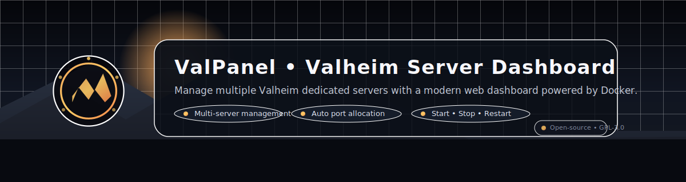

# ValPanel – Valheim Server Dashboard

[](gpl-3.0.txt)
[](#docker-quick-start)
[](app/app.py)

ValPanel is a lightweight control plane for running multiple Valheim dedicated servers on a single host. It wraps the excellent [`lloesche/valheim-server`](https://hub.docker.com/r/lloesche/valheim-server) image with a modern Flask backend, SQLite persistence, and a sleek dashboard so you can create, restart, and monitor worlds without touching SSH.



---
## Table of Contents
1. [Why ValPanel?](#why-valpanel)
2. [Features](#features)
3. [Architecture](#architecture)
4. [Requirements](#requirements)
5. [Docker Quick Start](#docker-quick-start)
6. [Docker Compose Example](#docker-compose-example)
7. [Configuration](#configuration)
8. [First Run Flow](#first-run-flow)
9. [API Highlights](#api-highlights)
10. [Local Development](#local-development)
11. [Project Structure](#project-structure)
12. [Roadmap](#roadmap)
13. [Contributing](#contributing)
14. [License](#license)
15. [Credits](#credits)

## Why ValPanel?
- **CasaOS / TrueNAS / Proxmox friendly** – drop-in container with Docker socket access
- **No CLI gymnastics** – web UI + REST API for everything from provisioning to deletion
- **Crash safe** – restart stuck servers, recreate containers, and tail logs from the panel
- **Role-aware** – admins can invite moderators with scoped permissions

## Features
- Multi-server orchestration with automatic, non-overlapping UDP port allocation
- Guarded first-run flow that forces creation of an admin account
- Role-based access control (admin/moderator) driven by invite tokens
- REST API plus bundled dashboard for create/start/stop/restart/delete
- Dedicated config/world/backup directories per server under `DATA_ROOT`
- Docker log streaming to help diagnose crashes without SSH
- Works great on CasaOS, TrueNAS SCALE, Proxmox, Unraid, and bare-metal Linux hosts

## Architecture
ValPanel itself runs as a single container that bundles:
- Python 3.12, Flask, SQLAlchemy, and the Docker SDK
- SQLite database stored under `/app/data` (bind mount for persistence)
- HTML/CSS dashboard served via Jinja templates
- REST API endpoints under `/api/*`

Each Valheim world spins up as its own `lloesche/valheim-server` container. The panel keeps track of which 3-port block was assigned, manages per-world directories under `/servers/<slug>/`, and can recreate containers if they disappear.

## Requirements
- Docker Engine 20.10+ (panel needs access to `/var/run/docker.sock`)
- ~4 GB RAM per Valheim server plus room for the panel container
- Host storage for `/app/data` (panel DB) and `/servers` (world files & backups)
- Open TCP port 8000 (configurable) for the dashboard/API

## Docker Quick Start
```bash
docker run -d \
  --name valpanel \
  -p 8000:8000 \
  -e TZ=Europe/Stockholm \
  -e PANEL_PORT=8000 \
  -e VALHEIM_IMAGE=lloesche/valheim-server \
  -e VALHEIM_PORT_RANGE_START=24560 \
  -e VALHEIM_PORT_RANGE_END=24660 \
  -e VALHEIM_PORT_BLOCK_SIZE=3 \
  -e DATA_ROOT=/mnt/apps/valpanel/servers \
  -v /mnt/apps/valpanel/data:/app/data \
  -v /mnt/apps/valpanel/servers:/mnt/apps/valpanel/servers \
  -v /var/run/docker.sock:/var/run/docker.sock \
  stradios/valpanel:latest
```
Navigate to `http://localhost:8000/setup` to create the first admin user.

## Docker Compose Example
```yaml
version: "3.8"

services:
  valpanel:
    image: stradios/valpanel:latest
    container_name: valpanel
    restart: unless-stopped
    ports:
      - "8000:8000"
    environment:
      TZ: Europe/Stockholm
      PANEL_PORT: 8000
      VALHEIM_IMAGE: lloesche/valheim-server
      VALHEIM_PORT_RANGE_START: 24560
      VALHEIM_PORT_RANGE_END: 24660
      VALHEIM_PORT_BLOCK_SIZE: 3
      DATA_ROOT: /mnt/apps/valpanel/servers
    volumes:
      - /mnt/apps/valpanel/data:/app/data
      - /mnt/apps/valpanel/servers:/mnt/apps/valpanel/servers
      - /var/run/docker.sock:/var/run/docker.sock
```
> See `valpanel.yaml`, `compose.yaml`, or `compose.debug.yaml` for additional deployment options.

## Configuration
| Variable | Default | Description |
| --- | --- | --- |
| `PANEL_PORT` | `8000` | HTTP port exposed by Flask |
| `DATABASE_URL` | `sqlite:////app/data/valpanel.db` | SQLAlchemy connection string |
| `SECRET_KEY` | `dev-change-me` | Flask session secret – override in production |
| `VALHEIM_IMAGE` | `lloesche/valheim-server` | Docker image used per Valheim server |
| `VALHEIM_PORT_RANGE_START` | `24560` | First UDP port to allocate |
| `VALHEIM_PORT_RANGE_END` | `24660` | Last UDP port in the allocation pool |
| `VALHEIM_PORT_BLOCK_SIZE` | `3` | Number of contiguous UDP ports per server |
| `DATA_ROOT` | `/servers` | Host path containing per-world config/save/backup dirs |
| `TZ` | `Europe/Stockholm` | Time zone propagated to the Valheim containers |
| `PUBLIC_BASE_URL` | _(empty)_ | Optional base URL for invite links |

## First Run Flow
1. Start the panel (Docker or local) and open `/setup`.
2. Create the initial admin account (enforced by `ensure_admin_setup`).
3. Log in and create Valheim worlds via the dashboard; ValPanel provisions directories under `DATA_ROOT` and launches Docker containers.
4. Invite moderators with `POST /api/invites` or through the UI; they finish registration via `/register?token=<token>`.

## API Highlights
- `POST /api/setup/admin` – bootstrap the first admin account
- `POST /api/auth/login` / `POST /api/auth/logout` – session management
- `GET /api/servers` – list servers + Docker status
- `POST /api/servers` – create a new server (admin only)
- `POST /api/servers/<id>/(start|stop|restart)` – lifecycle controls
- `DELETE /api/servers/<id>` – remove server + container + data (admin only)
- `GET /api/servers/<id>/logs?tail=500` – stream recent container logs

Every endpoint enforces authentication, and decorators guard admin-only routes.

## Local Development
```bash
cd app
python -m venv .venv
source .venv/bin/activate
pip install -r requirements.txt
export DATA_ROOT=$PWD/../servers
export PANEL_PORT=8000
python app.py
```
- Point your browser to `http://localhost:8000/setup` to create the admin user.
- The panel expects access to a Docker daemon; running locally with Docker Desktop or Colima works well.

## Project Structure
```
.
├── app/
│   ├── app.py
│   ├── config.py
│   ├── models.py
│   ├── templates/
│   ├── requirements.txt
│   └── Dockerfile
├── data/
├── servers/
├── compose.yaml
├── compose.debug.yaml
├── valpanel.yaml
├── gpl-3.0.txt
└── README.md
```

## Roadmap
**v0.4**
- Dashboard log tab with filtering
- Real-time container status polling
- Player count detection via UDP query
- Delete/restart confirmation modals
- Automated world backups from the panel

**v1.0**
- Full admin/moderator permissions UI
- World presets & optional mod support
- Cloud backup targets (S3, B2, etc.)
- REST API for external tooling + webhooks
- Theme system (dark/light)

## Contributing
1. Fork the repo
2. Create a feature branch: `git checkout -b feature/amazing`
3. Commit + push your changes
4. Open a Pull Request and describe your testing

Bug reports and feature ideas are equally welcome via GitHub Issues.

## License
Released under the GNU General Public License v3.0. See [`gpl-3.0.txt`](gpl-3.0.txt) for the full text.

## Credits
Created and maintained by **Theodor Veres (Stradios)** – founder of the Nort-Sun Gaming Community and creator of ValPanel. Learn more at [nort-sun.com](https://www.nort-sun.com).
